# 츄!러스 미: 공감 기반 심리 케어 AI

LG U+ Why Not SW Camp 7기 피사모 프로젝트의 첫 번째 레포지토리입니다.

## 1. 팀원 소개

<table>
  <tr>
    <th>김지희</th>
    <th>배형진</th>
    <th>김다은</th>
    <th>이은영</th>
  </tr>
  <tr>
    <td>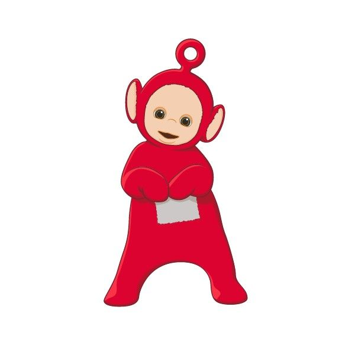</td>
    <td>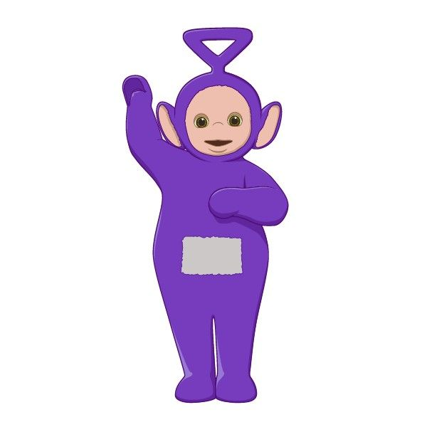</td>
    <td>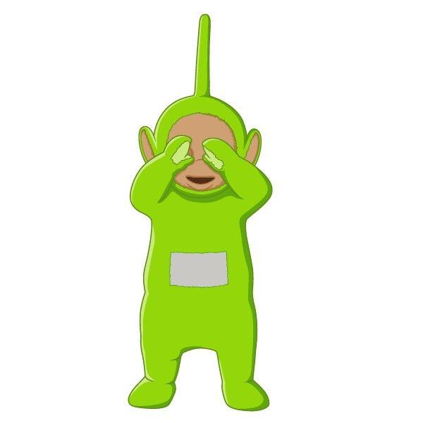</td>
    <td>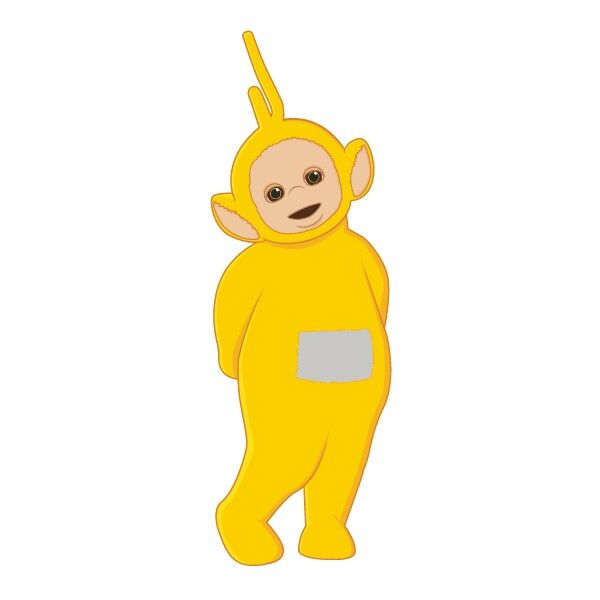</td>
  </tr>
  <tr>
    <td>팀장</td>
    <td>발표자</td>
    <td>리서처</td>
    <td>기록자</td>
  </tr>
  <tr>
    <td>
      
    </td>
    <td>
      
    </td>
    <td>
      
    </td>
    <td>
      
    </td>
  </tr>
</table>

---

🔗 **상세 기획서 바로가기:** [프로젝트 기획서](https://github.com/whynotsw-camp/wh07-1st-Pisamo/blob/main/%ED%94%84%EB%A1%9C%EC%A0%9D%ED%8A%B8%20%EA%B8%B0%ED%9A%8D%EC%84%9C.pdf)

### 2-1. 프로젝트 개요
(1) 프로젝트 개요
- **주제:** 공감 기반 심리 케어 AI 서비스
- **문제 정의:** 많은 사람이 심리적 어려움을 겪지만, 기존 AI의 피상적인 답변에 한계를 느낍니다. 우리는 정서적 니즈를 충족시키는 AI를 개발하여 이 문제를 해결하고자 합니다.
- **목표:**
  1.  **정확한 감정 분석 및 공감적 대화**로 심리적 안정감 제공
  2.  **맞춤형 가이드라인**으로 긍정적인 행동 변화 유도
  3.  **신뢰할 수 있는 심리적 파트너**로서의 서비스 구축
- **기대 효과:** 심리 상담의 접근성 향상, 사용자의 정서적 안정 및 자기 이해 증진

---

### 2-2. 프로젝트 기획서 다이어그램

서비스 구성도

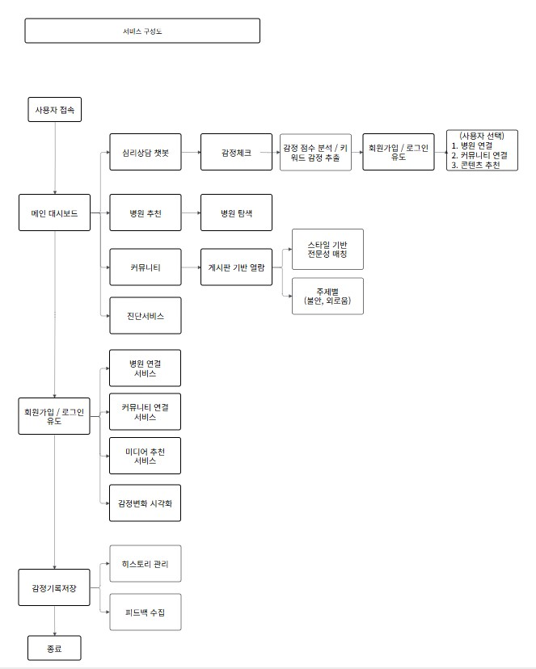
  

  

시스템 흐름도

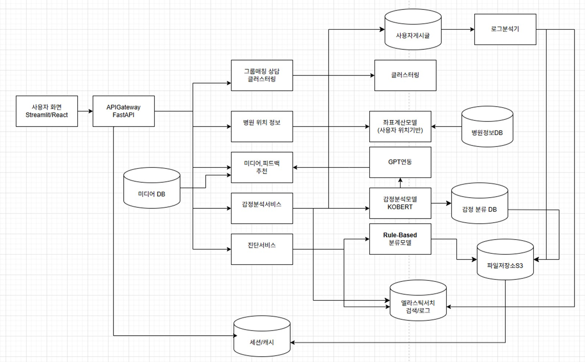
  

  

UI

 <tr>
    <td>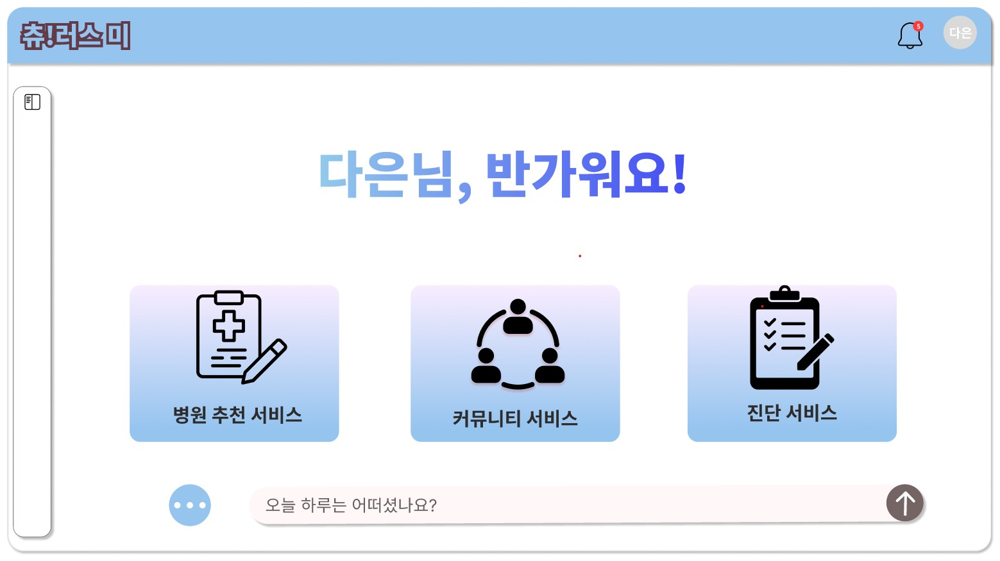</td>
    <td>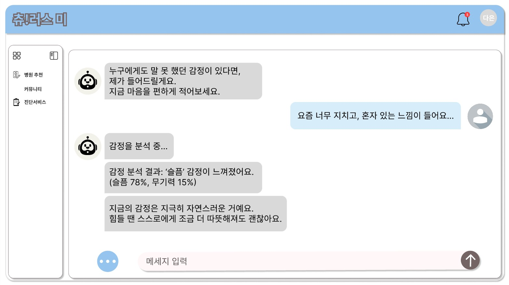</td>
    <td>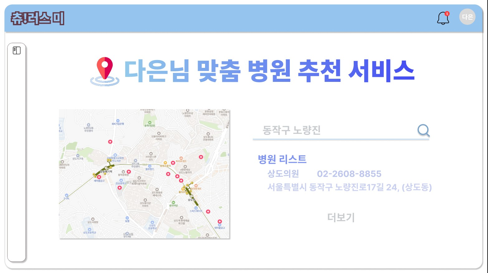</td>
  </tr>
    
 

 
  ---

# 3. 작업 분할 구조 (WBS)

 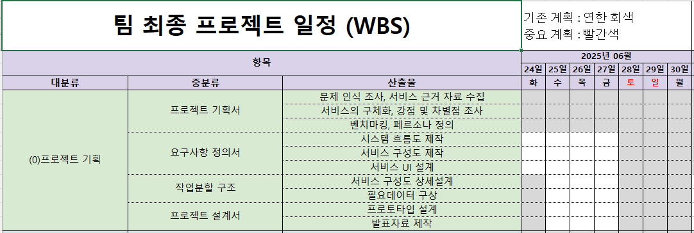
 
🔗 **WBS 바로가기:** [WBS](1차프로젝트_산출물/1처프로젝트_WBS.xlsx)

  ------------------------------

# 4. 요구사항 정의

🔗 **요구사항 정의서 바로가기:** [요구사항 정의서.pdf](https://github.com/whynotsw-camp/wh07-1st-Pisamo/blob/main/%EC%9A%94%EA%B5%AC%EC%82%AC%ED%95%AD%20%EC%A0%95%EC%9D%98%EC%84%9C.pdf)

----------------------------

# 5. 프로젝트 발표 및 프로토타입 

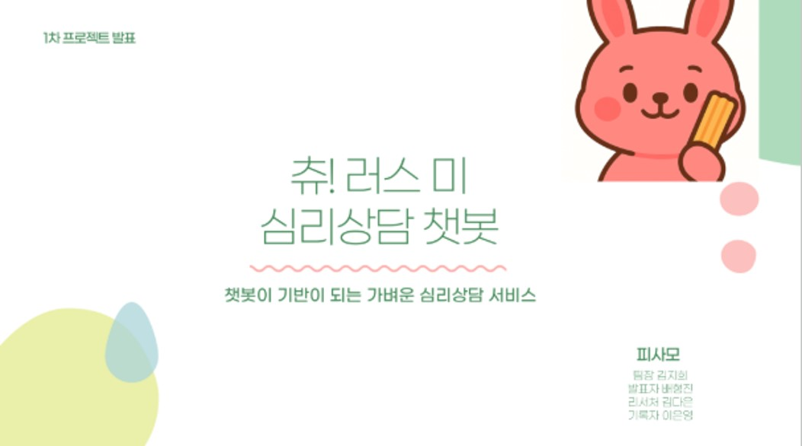
  
🔗 **1차 프로젝트 ppt 바로가기:** [프로젝트 발표.pptx](1차프로젝트_산출물/1차프로젝트_발표자료.pptx)
  

## 프로토타입 구동 영상 (GPT-api 연동)

   
